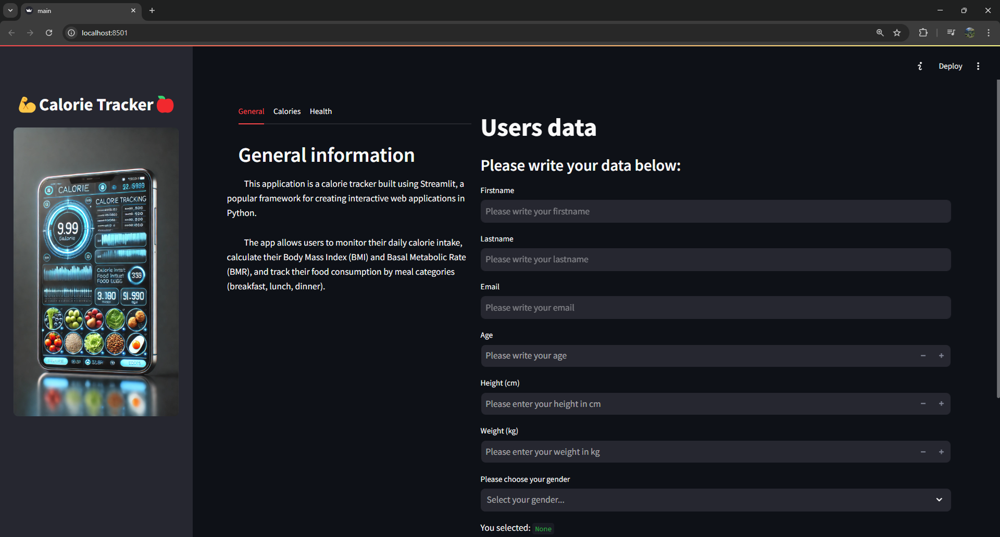
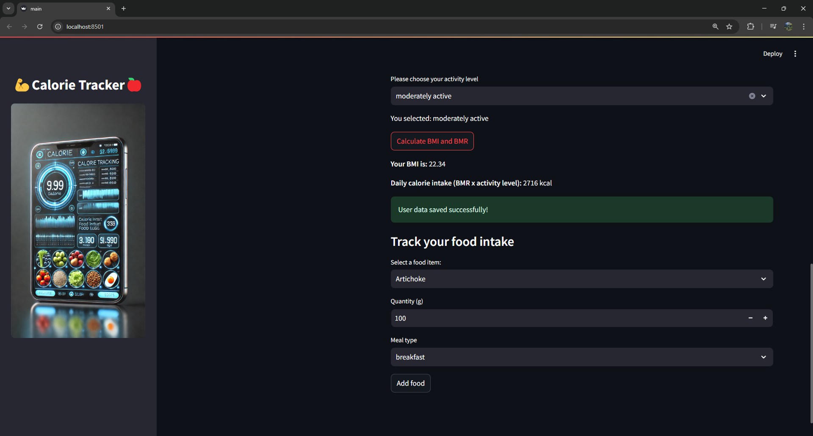
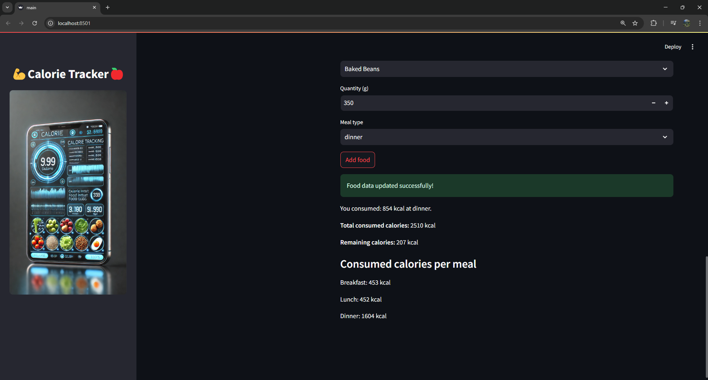

💪 Calorie Tracker App 🍎

## Description

The **Calorie Tracker** app is an interactive tool built using **Streamlit** to help users monitor their daily calorie intake, calculate their Body Mass Index (BMI) and Basal Metabolic Rate (BMR), and track their food consumption by meal categories (breakfast, lunch, dinner).

The app is designed to be user-friendly and provides useful information about nutrition, exercise, and calorie management.

---

## Features

### 1. **User Data Input**
   - Users can enter their personal data, such as:
     - First name and last name
     - Age
     - Height and weight
     - Gender
     - Activity level

### 2. **BMI and BMR Calculation**
   - The app calculates:
     - **BMI (Body Mass Index):** Using the standard formula.
     - **BMR (Basal Metabolic Rate):** Using the Mifflin-St Jeor equation.
     - **Daily Calorie Needs:** Based on BMR and activity level.

### 3. **Calorie Tracking**
   - Users can select food items from a predefined list and enter the quantity consumed.
   - The app calculates the calories consumed and displays the remaining calories to reach the daily goal.

### 4. **Nutrition and Exercise Information**
   - The app provides useful information about:
     - What is a calorie?
     - Daily calorie needs.
     - How to manage weight.
     - Calories burned through exercise.
     - Benefits of exercise and recommended types of exercise.

---

## How to Use the App

1. **Enter Personal Data:**
   - Fill in the fields for name, age, height, weight, gender, and activity level.

2. **Calculate BMI and BMR:**
   - Click the **"Calculate BMI and BMR"** button to get the results.

3. **Track Calories Consumed:**
   - Select a food item from the list and enter the quantity consumed.
   - The app will display the calories consumed and the remaining calories.

4. **View Statistics:**
   - The app displays calories consumed by meal categories (breakfast, lunch, dinner).

---

## Technologies Used

- **Streamlit:** For the graphical interface and interactivity.
- **SQLAlchemy:** For database management.
- **Pandas:** For handling data from CSV files.
- **PyIsEmail:** For email address validation.

---

## How to Run the App

1. **Clone the Repository:**
   ```bash
   git clone <repository_url>
   cd CalorieApp
2. **Install Dependencies:**
   ```bash
    pip install -r requirements.txt
3. **Run the App:**
   ```bash
    streamlit run app.py
4. **Open the App in Your Browser:**
    - **Streamlit:** The app will be available at http://localhost:8501.

---

## Project Structure

    CalorieApp/
    ├── src/
    │   ├── database/
    │   │   ├── __init__.py
    │   │   ├── calorie_tracker.py       # CalorieTracker class
    │   │   ├── models.py               # SQLAlchemy models (e.g., User)
    │   │   ├── email_function.py       # Email validation
    │   │   └── csv_files.py              # Database session
    │   ├── settings.py                 # Configuration and paths
    │   └── data/
    │       └── calories.csv            # Food calorie data
    ├── images/                         # Images for the app
    │   ├── sidebar.jpg
    │   ├── main_interface.png
    │   ├── calculation.png
    │   └── tracking.png
    ├── main.py                          # Main Streamlit app
    ├── requirements.txt                # Dependencies
    ├── README.md                       # Project documentation
    └── LICENSE                         # License file
---

## Database Schema

Database Schema: calorie_tracker

Table: users
- id (Integer, Primary Key, Auto Increment)
- firstname (String(30), Not Null)
- lastname (String(30), Not Null)
- age (Integer, Not Null)
- gender (String(10), Not Null)
- bmr (Integer, Not Null)
- consumed_calories (Integer, Not Null)
- remaining_calories (Integer, Not Null)

---

## Screenshots

### Main Interface


### BMI and BMR Calculation


### Calorie Tracking


---

## Contributions

Contributions are welcome! If you'd like to contribute to this project, please:

1. **Fork the repository.**
2. **Create a new branch for your feature:**
   ```bash
   git checkout -b feature/feature-name
3. **Commit your changes:**
   ```bash
   git commit -m 'Add a new feature' 
4. **Push the branch:**
   ```bash
   git push origin feature/feature-name
5. **Open a Pull Request.**

---

## License

This project is licensed under the MIT License. See the LICENSE file for details.

---

## Contact  
- **Name**: Siculan Alexandru-Vlad
- **Email**: vladsiculan@gmail.com
- **GitHub**: vladsiculan


